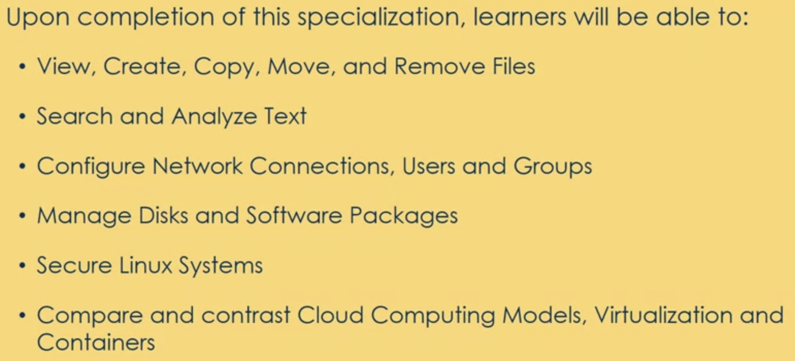

## An Introduction to Linux

Here we will see what we mean by DevOps and its core components:  
#### Learning Objectives
- view, create, copy, move and remove files
- search and analyse text
- configure network connection, user & groups 
- manage disks and software packages

In the following pages we will learn more about 

#### Linux Common Commands - frequently used
Common Commands (part I)
• pwd – returns the path of the current
working directory
• cd – change directory
• cd .. (with two dots) to move one directory up
• cd to go straight to the home folder
• cd- (with a hyphen) to move to your previous
directory
• ls - view the contents of a directory
• ls -R will list all the files in the sub-directories as well
• ls -a will show the hidden files
• ls -al will list the files and directories with detailed
information like the permissions, size, owner, etc.

Common Commands (part II)
• cat – list the contents of a file on the
standard output
• cat > filename creates a new file
• cat filename1 filename2>filename3 joins two
files and stores the output of them in a new file
• cp – copy files
• mv – move or rename files
• mkdir – create a new directory in the
current directory
• rm – remove file and directories
• rm –r to remove directory and all files inside

---

[Next: Day 0](00-day00.md)

[Home](../index.md)

[Top](02-LinuxIntro.md)

