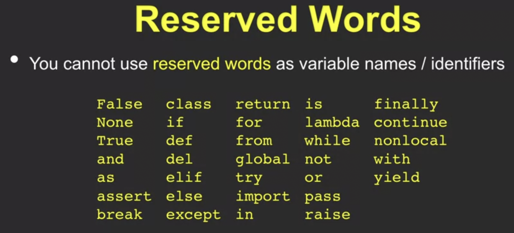
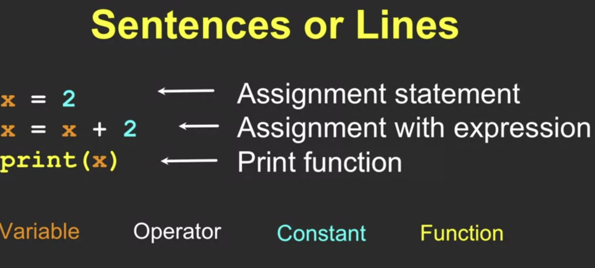
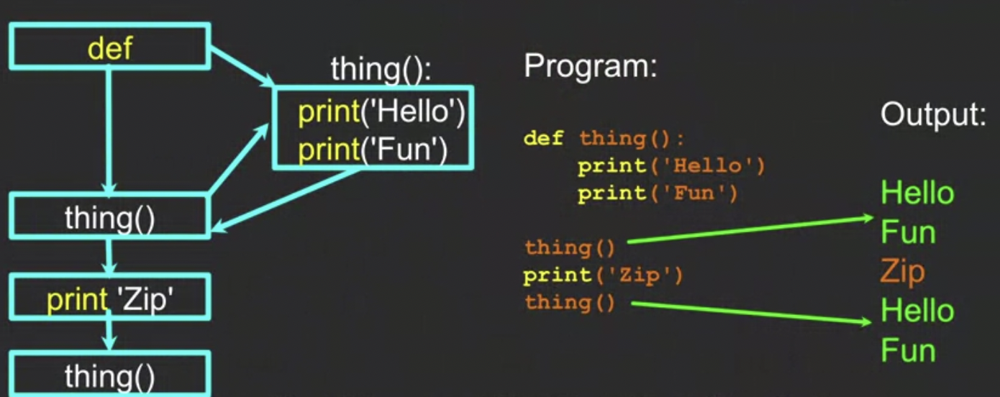

## An Introduction to Python

We will learn Python from scratch. To learn any language we need to learn its elements, similar to what how we learn English. So let us see the elements of Python comparing it to English learning:
1. Vocalubary/words - variables and **Reserver words** - use this words the way Python expects us to use, we cannot use it as a **variable**. 


2. Sentence structure - validate syntax patterns (set of instructions)


3. Story structure - constructing a program for a purpose. Write 2-3 lines of script on command prompt >>>, interactive mode but not more, reason bigger set of scripts or instructions should be written in a file and save it with extension **.py** .py is python file. Thus choose ***Interactive*** vs ***Script*** as per your purpose. 

#### Expressions
- Constants - they don't change values assigned. 
- Reserve Words - as mentioned above, they have specific use, e.g., False, is, class, return, finally, none, if, for, lambda, try, break, in, etc.
- Variable - container which can contain values assinged. ```x= 1; y=2; z = x+y``` 
- Operator - ``` +, -, *, /``` are arithmetic operators
- Function - method to perform a task, takes input and can have output. 
- User Input - input() ``` name = input('who are you?')
print('Welcome', name)``` comma will add space inbetween
- Comments - ```# ```Python ignores lines starting with #.

#### Conditional Execution
- Comparisioin operators - ``` ==, >, >=, <, <=, != ``` Indenting is imporant here (4 spaces), depending upon indentation block of code will be executed, nesting will further indent the code. 
``` If (x==1):```  
```indent....print('indent applied')```
- Multi-way - if: and elif: and then else: (elif is new to me) one of the three will run. Multiple if can be written with elif, like if, then elif, then elif, then elif and finally may not may not have else. 
- The ``` try / except ``` structure (similar to try/catch). Surround code with try/except to handle errors. If code in try works then except is skipped, if code in try fails then except works. 
#### Functions
- Set of code store and reuse

- manage disks and software package


#### Linux Common Commands - frequently used
##### Common Commands (part I)  
- cd to go straight to the home folder
- **cd-** (with a hyphen) to move to your previous directory
#### Common Commands (part II)
- cp – copy files
- mv – move or rename files

#### Common Commands (part II)

#### Common Commands (part II)

Reference:    
Check this ebook [Python](https://books.trinket.io/pfe/index.html)


---

[Next: Day 0](00-day00.md)

[Home](../index.md)

[Top](03-PythonIntro.md)


